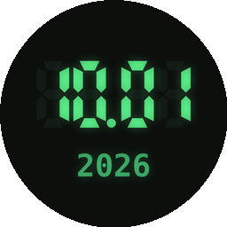
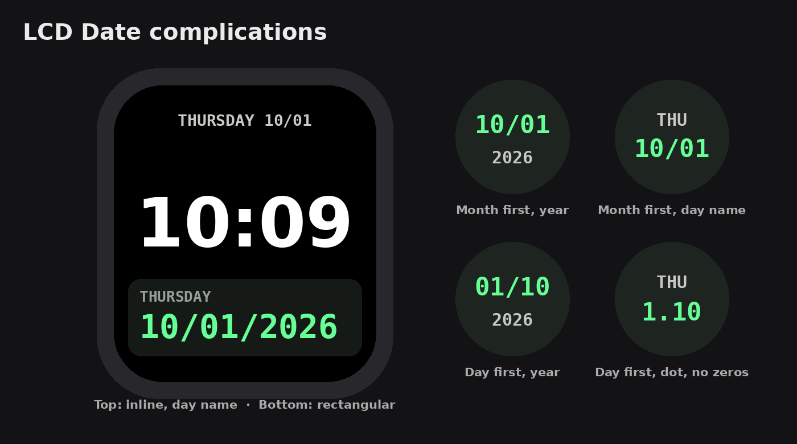

# LCD Date

<p align="center">
  
</p>

**LCD Date** is a tiny Apple Watch app that puts today's date on your watch face as plain numbers, in a retro digital-watch style: month first like `10/01/2026`, or day first like `01/10/2026`, with the year or the day of the week (`THURSDAY 10/01`).



## Features

### Complications

| Slot | With the year | With the day name |
|---|---|---|
| **Circular** | `10/01` with `2026` underneath | `THU` on top, then `10/01` |
| **Rectangular** | `THURSDAY`, then `10/01/2026` in big digits | Same (always shows both) |
| **Corner** | `10/01`, with `2026` on the curved label | `10/01`, with `THURSDAY` on the curved label |
| **Inline** | `10/01/2026` | `THURSDAY 10/01` |

Day names follow your watch's language.

When you add the complication, pick the style you like from 24 choices. Every style comes four ways, side by side: with or without leading zeros (for March 5: `03/05/2026` or `3/5/2026`), and with the year or the day name. Examples are for Thursday, October 1, 2026:

| Style | Month first | Day first |
|---|---|---|
| Slash | `10/01/2026` | `01/10/2026` |
| Slash, day name | `Thursday 10/01` | `Thursday 01/10` |
| Slash, no zeros | `10/1/2026` | `1/10/2026` |
| Slash, no zeros, day name | `Thursday 10/1` | `Thursday 1/10` |
| Dash | `10-01-2026` | `01-10-2026` |
| Dash, day name | `Thursday 10-01` | `Thursday 01-10` |
| Dash, no zeros | `10-1-2026` | `1-10-2026` |
| Dash, no zeros, day name | `Thursday 10-1` | `Thursday 1-10` |
| Dot | `10.01.2026` | `01.10.2026` |
| Dot, day name | `Thursday 10.01` | `Thursday 01.10` |
| Dot, no zeros | `10.1.2026` | `1.10.2026` |
| Dot, no zeros, day name | `Thursday 10.1` | `Thursday 1.10` |

- **Flips at your local midnight, anywhere.** The complication checks in every 15 minutes and always uses the watch's *current* time zone. Every time zone on Earth is a multiple of 15 minutes from UTC, so the date changes at exactly 12:00 AM local time, even right after you fly to another country, including half-hour zones like India and Nepal's +5:45.
- **Always month/day/year.** It uses the regular (Gregorian) calendar even if your watch is set to a different calendar system, so the numbers are never confusing.
- **Retro look.** Monospaced digits tinted LCD green, which follows your watch face's color when the face is tinted.

### Watch app

A retro LCD-style screen showing today's date and day of the week, with quick steps for adding the complication. Tap the date to switch between month first and day first.

## Add it to your watch face

1. Touch and hold your watch face, then tap **Edit**.
2. Swipe to **Complications** and tap a slot.
3. Choose **LCD Date**, then pick a style: **Month first** or **Day first**, with the year or the day name.

## Requirements

- Apple Watch on **watchOS 27** or later (watch-only app, no iPhone app needed)
- **Xcode 27** or later
- Built with SwiftUI, WidgetKit and App Intents. No third-party dependencies.

## Build & run

1. Open `LCD Date.xcodeproj` in Xcode.
2. Under **Signing & Capabilities**, choose your own Team for both targets: **LCD Date Watch App** and **LCDDateWidgetsExtension**. Change the bundle identifiers if needed.
3. Pick the **LCD Date Watch App** scheme and your Apple Watch (or a watch simulator), then press **▶ Run**.
4. Add the complication to a watch face (see above).

## Project structure

```
LCD Date Watch App/       The watch app (retro LCD date screen)
  ContentView.swift
  LCDDateApp.swift
  Assets.xcassets/        App icon and accent color
LCDDateWidgets/           WidgetKit extension with the complications
  LCDDateWidgets.swift    Date styles, timeline, complication views
  Info.plist
LCD Date.xcodeproj/       Xcode project
docs/                     Images for this README
```

The bundle identifiers (`com.senalbert.M-D.watchkitapp`) keep the app's original working name, M-D. They're never shown to users, and keeping them means watches that already have the app installed update it instead of treating it as a new app.

## Privacy

LCD Date has no accounts, ads, analytics or network code, and asks for no permissions. It only reads the watch's own date and time zone. For the App Store privacy label, this app is **Data Not Collected**.

## Author

Created by Senalbert Rodriguez.

## License

LCD Date is free and open source under the [MIT License](LICENSE). You're welcome to use it, learn from it, change it and share it. Just keep the copyright notice.
